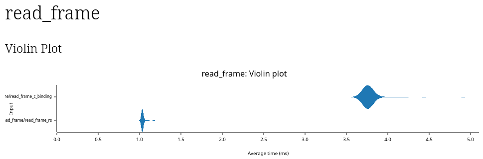

# extxyz

Extended XYZ specification and parsers.

Implemented in rust, with python binding provided 

⚠️ Project status: This repository is still under active development.
Basic read and write functionality is implemented, but the API and features are not yet finalized or fully polished.

Benchmarking is a key upcoming focus, particularly on large-scale structures, to ensure performance and robustness.

See below the roadmap section for the planned steps toward the first stable release.

## Why/when you should/shouldnt use old c implementation aka `libAtoms/extxyz`

You should use [`libAtoms/extxyz`](https://github.com/libAtoms/extxyz) if you want

- use julia binding (but we can add it to extxyz, no time work on it at the moment).
- use fortran binding.

You should use `extxyz/extxyz` if you want

- robust parsing that won't end up at segmentfault when your input is slightly misalign (e.g. leading spaces)
- nice error showing you where exactly the input is not able to be parsed.
- nice formatting write to the output, it takes care of accurate alignment for every format.
- read from flexible input that compatible for legacy libAtoms/extxyz but no segfalut for what expected to be readable.
- latest python version support.
- use it in WebAssembly.
- use it as a rust dependency.
- streaming on read/write without blowup you RAM for trajactories of large structure.

## Performance benchmark

Compare with the legacy c implementation in `libAtoms/extxyz`, the rust implementation is nearly 4 times faster.
The benchmark is done in parsing a > 20k atoms structure.



## Memory benchmark

### No memory leak in rust implementation 

The rust implementation is memory safe, no memory leak validated by valgrind.

On the contrary, `libAtoms/extxyz` has memory leak, manifested by:

```
valgrind --leak-check=full ./target/release/read_frame_legacy_c

==1485786== 215,052 (24 direct, 215,028 indirect) bytes in 1 blocks are definitely lost in loss record 203 of 203
==1485786==    at 0x48AB7A8: malloc (vg_replace_malloc.c:446)
==1485786==    by 0x401D458: cleri_grammar (in /home/jyu/rust/extxyz/target/release/read_frame_legacy_c)
==1485786==    by 0x4017DDB: read_frame_legacy_c::main (in /home/jyu/rust/extxyz/target/release/read_frame_legacy_c)
==1485786==    by 0x4018F02: std::sys::backtrace::__rust_begin_short_backtrace (in /home/jyu/rust/extxyz/target/release/read_frame_legacy_c)
==1485786==    by 0x4018EF8: std::rt::lang_start::{{closure}} (in /home/jyu/rust/extxyz/target/release/read_frame_legacy_c)
==1485786==    by 0x402BCA5: std::rt::lang_start_internal (in /home/jyu/rust/extxyz/target/release/read_frame_legacy_c)
==1485786==    by 0x4018EE4: main (in /home/jyu/rust/extxyz/target/release/read_frame_legacy_c)
```

### low memory footprint when read frames

Rust implementation use buffer to read frames, the memory usage is not cumulated with the increasing of read frames.
An iterator is returned, which has the lifetime as the file handler.

Here is the memory footprint recorded using `valgrind --tool=massif`:

```
    KB
10.48^                                                                  :     
     |#: :    : ::::::::: : :  @    :    :: :: ::@@ ::::   ::   :::  :  :@  ::
     |#  :: :::@: :: :: : : :  @:: ::    : ::  ::@  : : :  ::   :::  :: :@  ::
     |# ::::: :@: :: :: :::::::@: ::::::@: ::  ::@ :: : :@@::@  :::: ::::@::::
     |# ::::: :@: :: :: :::::::@: :::: :@: :: :::@ :: : :@ ::@:::::::::::@::::
     |# ::::: :@: :: :: :::::::@: :::: :@: :: :::@ :: : :@ ::@: :::::::::@::::
     |# ::::: :@: :: :: :::::::@: :::: :@: :: :::@ :: : :@ ::@: :::::::::@::::
     |# ::::: :@: :: :: :::::::@: :::: :@: :: :::@ :: : :@ ::@: :::::::::@::::
     |# ::::: :@: :: :: :::::::@: :::: :@: :: :::@ :: : :@ ::@: :::::::::@::::
     |# ::::: :@: :: :: :::::::@: :::: :@: :: :::@ :: : :@ ::@: :::::::::@::::
     |# ::::: :@: :: :: :::::::@: :::: :@: :: :::@ :: : :@ ::@: :::::::::@::::
     |# ::::: :@: :: :: :::::::@: :::: :@: :: :::@ :: : :@ ::@: :::::::::@::::
     |# ::::: :@: :: :: :::::::@: :::: :@: :: :::@ :: : :@ ::@: :::::::::@::::
     |# ::::: :@: :: :: :::::::@: :::: :@: :: :::@ :: : :@ ::@: :::::::::@::::
     |# ::::: :@: :: :: :::::::@: :::: :@: :: :::@ :: : :@ ::@: :::::::::@::::
     |# ::::: :@: :: :: :::::::@: :::: :@: :: :::@ :: : :@ ::@: :::::::::@::::
     |# ::::: :@: :: :: :::::::@: :::: :@: :: :::@ :: : :@ ::@: :::::::::@::::
     |# ::::: :@: :: :: :::::::@: :::: :@: :: :::@ :: : :@ ::@: :::::::::@::::
     |# ::::: :@: :: :: :::::::@: :::: :@: :: :::@ :: : :@ ::@: :::::::::@::::
     |# ::::: :@: :: :: :::::::@: :::: :@: :: :::@ :: : :@ ::@: :::::::::@::::
   0 +----------------------------------------------------------------------->Gi
     0                                                                   1.344
```

### low memory footprint when read large frame (20,000 lines)

The file itself is ~ 758 kb, use buffer read, the file won't be loaded as a whole.
The memory usage is all from the final constructed structure result.
The total memory usage (2.53mb) is half of libAtoms's c implementation (parsing same file requires 4.74 mb)

```
    MB
2.528^                                                                      # 
     |                                                                @@@@:@# 
     |                                                          @@@:@@@@@@:@#:
     |                                                     :::::@@@:@@@@@@:@#:
     |                                              ::::::::::: @@@:@@@@@@:@#:
     |                                       ::::::::::::: :::: @@@:@@@@@@:@#:
     |                                  ::@@:::::::::::::: :::: @@@:@@@@@@:@#:
     |                            ::::::::@@:::::::::::::: :::: @@@:@@@@@@:@#:
     |                     @@@@:::: ::: ::@@:::::::::::::: :::: @@@:@@@@@@:@#:
     |              ::@@@@@@@ @:: : ::: ::@@:::::::::::::: :::: @@@:@@@@@@:@#:
     |        ::::@:::@ @@ @@ @:: : ::: ::@@:::::::::::::: :::: @@@:@@@@@@:@#:
     |   ::@:@::: @:::@ @@ @@ @:: : ::: ::@@:::::::::::::: :::: @@@:@@@@@@:@#:
     | ::: @:@::: @:::@ @@ @@ @:: : ::: ::@@:::::::::::::: :::: @@@:@@@@@@:@#:
     | ::: @:@::: @:::@ @@ @@ @:: : ::: ::@@:::::::::::::: :::: @@@:@@@@@@:@#:
     | ::: @:@::: @:::@ @@ @@ @:: : ::: ::@@:::::::::::::: :::: @@@:@@@@@@:@#:
     | ::: @:@::: @:::@ @@ @@ @:: : ::: ::@@:::::::::::::: :::: @@@:@@@@@@:@#:
     | ::: @:@::: @:::@ @@ @@ @:: : ::: ::@@:::::::::::::: :::: @@@:@@@@@@:@#:
     | ::: @:@::: @:::@ @@ @@ @:: : ::: ::@@:::::::::::::: :::: @@@:@@@@@@:@#:
     | ::: @:@::: @:::@ @@ @@ @:: : ::: ::@@:::::::::::::: :::: @@@:@@@@@@:@#:
     | ::: @:@::: @:::@ @@ @@ @:: : ::: ::@@:::::::::::::: :::: @@@:@@@@@@:@#:
   0 +----------------------------------------------------------------------->Mi
     0                                                                   96.84
```

## Writer formatting

- keys and values in the info line keeps its original format

## Round-trip tests

To fully backward compatible with legacy `libAtoms/extxyz` which used in the community for long time.
I run following round-trip tests to ensure the behavior align with old specification.

- `.xyz` --`extxyz`/read --> inner --`extxyz`/write--> `.xyz`-01 --`cextxyz`/read--> inner --> `.xyz`-02
- test xyz-01 exatly the same as xyz-02 in content.

## TODO: some ambiguse inputs that need to recheck for legacy and new parser
- what if Properties has same keys but different shape? will undefiened override happens?
- arr rows has spaces padding cause segfault

## Specification

### Types to be parsed in the info line (line 2nd)

- Float
- Int
- Boolean
- bare string
- string

#### Type promotion

In array, Int will promote to Float. No other promote rules.
This is different from libAtoms/extxyz because blindly promote will cause ambiguity.
For example, if bool can be promote to string, it is a "True" on "T" or "true"?
If user put an Int of Float, them meant to say it is a number. If there are string parsed from the same array, it is usually indicate an invalid element in the input file.

### "Properties" shape

- in writing, the shape in the "Properties" field is deduct from raw data after the info line. Internally, the "Properties" is ensure the same with the real shape. It is been verified in the frame creation. The frame is not able to be created by hand (I do not provide any constructors from the struct) from struct but always from raw text.
- in reading, the "Properties" is read and stored, and the deduct shape is compute and validate against the claimed "Properties" shape. If not conform with each other, parsing should fail.

### Output format backward `libAtoms/extxyz` read compatibility

The output format is constrained with following rule, in order that the output format can be read by the legacy `libAtoms/extxyz`.

- No leading spaces for each line.
- `Properties` printed as the last key-value pair in the info line.

### Extend input format support

- accept leading spaces for each line.
- accept the info line is not key-value pair to able to parse unextend xyz format (with default Properties shape setup).

### Extend matrix format

- key with "Lattice" (or "lattice"/"lAttice"/... case-insensitive) is treat differently
- lattice store column-wise per vector.
- other matrix are formatted by array of (rows as arrays) as for example "[[e1, e2], [e3, e4], [e5, e6]]"
- empty array is invalid and cause parsing error e.g. `[]` is invalid.

## dev

Since all functionality is adapt to rust implementation, the legacy c code is only for test and benchmark purpose and will be removed in the end when this rust implementation get widely used.

To test with legacy C implementation binding, clone the `libAtoms/extxyz` source code (and its submodule `libcleri` for language parsing) as a submodule.

```console
git clone --recurse-submodules https://github.com/extxyz/extxyz.git
cd extxyz
```

### Make new Release

For pypi release:
- update version number at `python/Cargo.toml`. The version don't need to sync with rust crate version.
- trigger manually at CI workflow [`pypi-publish`](https://github.com/extxyz/extxyz/actions/workflows/pypi-publish.yaml)

For binary release and for crates.io release, they share same version number.

```console
# commit and push to main (can be done with a PR)
git commit -am "release: version 0.1.0"
git push

# actually push the tag up (this triggers dist's CI)
git tag v0.1.0
git push --tags
```

CI workflow of crates.io build can be trigger manually at CI workflow [`crate-publish`](https://github.com/EOSC-Data-Commons/datahugger-ng/actions/workflows/crate-publish.yaml).
But it will not run the final crates.io upload.

## Roadmap

- [ ] Julia binding
- [ ] Python binding
- [x] benchmark on speed when parsing large files.
- [x] read multiple frames.
- [x] benchmark the memory usage when parsing
- [x] ~~Fortran binding (not planned)~~
- [ ] ccmat integration through features tag

## License

All contributions must retain this attribution.

- Apache License, Version 2.0 ([LICENSE-APACHE](LICENSE-APACHE) or http://www.apache.org/licenses/LICENSE-2.0)
- MIT license ([LICENSE-MIT](LICENSE-MIT) or http://opensource.org/licenses/MIT)

